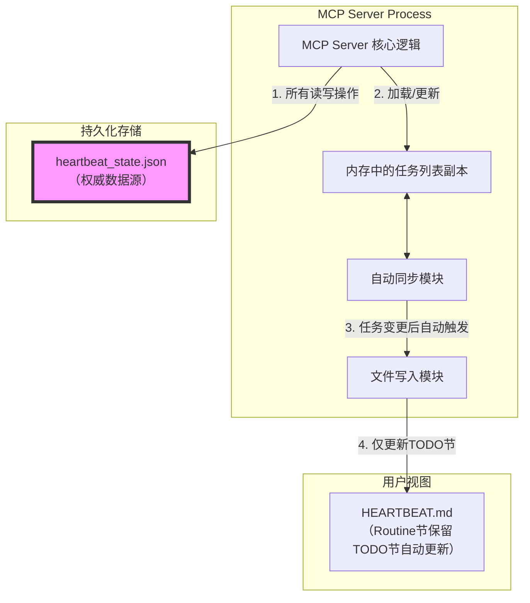

# MCP Heartbeat Task Manager Server 需求文档

## 1. 项目概述与目标

### 1.1 项目背景
在AI Agent的工作流中，通过`HEARTBEAT.md`文件手动管理任务状态是一种常见但易出错的方式。根据用户提供的Agent指南，Agent需要直接编辑该文件来创建任务、更新状态、添加结果等。这个过程极易导致格式错误、状态混乱和ID冲突。

### 1.2 项目目标
本项目旨在开发一个**Model Context Protocol (MCP) 服务器**，为AI Agent提供一个标准化的、程序化的接口来操作其任务清单。该服务器将封装所有与`HEARTBEAT.md`文件交互的复杂性，提供一套清晰、可靠的工具，并通过独立的持久化存储确保任务状态在服务重启后不丢失。

### 1.3 核心价值
- **减少错误**：消除因手动编辑Markdown文件导致的格式错误和状态不一致。
- **状态持久化**：引入独立的JSON存储文件，任务状态不再仅依赖于对`HEARTBEAT.md`的脆弱解析。
- **自动化ID管理**：自动生成并持久化存储符合规范（如`cool-apple`）的可读任务ID。
- **批量操作**：支持一次性更新任务的多个字段，提高Agent与工具的交互效率。
- **自动同步**：每次任务状态变更时自动更新`HEARTBEAT.md`的TODO部分，无需手动触发。
- **任务生命周期管理**：任务完成一段时间后自动从TODO列表移除，保持清单整洁。

## 2. 技术选型与架构

### 2.1 核心技术
- **MCP SDK**：使用 **Python** 和官方的 `mcp` 库（如 `FastMCP`）来构建MCP服务器，确保与MCP协议的完全兼容。
- **语言**：**Python 3.10+**。
- **数据验证**：使用 `Pydantic` 来定义和验证工具的输入/输出模式。
- **持久化**：使用 `JSON` 文件存储所有任务的内部状态。
- **文件解析**：使用正则表达式或简单的行解析来读写 `HEARTBEAT.md` 用于展示，但**所有权威数据以JSON文件为准**。

### 2.2 系统架构与持久化设计
该MCP服务器将采用**有状态（Stateful）** 设计，其核心状态（任务列表、ID映射）存储在一个独立的JSON文件中。`HEARTBEAT.md` 文件将作为此内部状态的“视图”或“导出”，**仅更新TODO部分**，保留Routine部分不变。所有修改操作都先更新JSON文件，然后自动同步回写到 `HEARTBEAT.md` 的TODO节。



## 3. 核心功能与工具定义

### 3.1 字段唯一性约束
**所有任务字段的key不允许重复**。在任务对象中，每个字段名必须是唯一的。工具实现时需验证输入字典中不包含重复key，若发现重复则返回明确的参数验证错误。

### 3.2 数据模型 (Pydantic)
```python
from pydantic import BaseModel, Field, validator
from typing import Optional, List, Dict, Any
from datetime import datetime
import random
import re

def generate_readable_id() -> str:
    """生成类似 'cool-apple', 'wild-coral' 的可读ID"""
    adjectives = ["cool", "wild", "brave", "swift", "quiet", "bright", "calm", "eager", "gentle", "happy"]
    nouns = ["apple", "coral", "tiger", "eagle", "stream", "mountain", "forest", "ocean", "star", "cloud"]
    return f"{random.choice(adjectives)}-{random.choice(nouns)}"

class Task(BaseModel):
    # 唯一标识，由服务器生成
    id: str = Field(default_factory=generate_readable_id)
    status: str = "Pending"  # Pending/Running/Complete/Fail
    
    # 核心字段，对应HEARTBEAT.md中的条目
    raw_user_request: str
    raw_reference: Optional[str] = None
    ideas: List[str] = Field(default_factory=list)
    result: Optional[str] = None
    result_file: Optional[str] = None
    
    # 元数据字段，不写入HEARTBEAT.md，仅用于内部跟踪
    created_at: datetime = Field(default_factory=datetime.now)
    updated_at: datetime = Field(default_factory=datetime.now)
    completed_at: Optional[datetime] = None  # 用于计算任务完成后的保留时间
    claude_session_id: Optional[str] = None
    
    # 保留原始请求的其他可能字段（动态扩展）
    extra_fields: Dict[str, Any] = Field(default_factory=dict)
    
    @validator('ideas', pre=True, always=True)
    def ensure_ideas_list(cls, v):
        if v is None:
            return []
        if isinstance(v, str):
            return [v]
        return v

class TaskState(BaseModel):
    tasks: List[Task] = Field(default_factory=list)
    # 维护ID到列表索引的映射，提高查找效率
    id_to_index: Dict[str, int] = Field(default_factory=dict)
```

### 3.3 工具集

#### 工具 1: `task_create`
- **描述**: 创建一个新的待办任务。服务器自动分配可读的唯一ID，并保存到JSON存储中。创建成功后自动触发`HEARTBEAT.md`的TODO节更新。
- **输入参数**:
    - `raw_user_request` (string, **必填**): 用户的原始请求全文或文件路径。
    - `raw_reference` (string, 可选): 相关的参考文件路径。
    - `ideas` (array[string], 可选): 初步的解决方案或想法列表。
    - `**extra_fields` (任意, 可选): 其他需要在任务中记录的键值对。所有key必须唯一，不能与预定义字段名重复。
- **验证要求**:
    - 所有传入的字段名（包括预定义字段和extra_fields中的key）不能重复。
    - extra_fields中的key不能与预定义字段名（id, status, raw_user_request, raw_reference, ideas, result, result_file, created_at, updated_at, completed_at, claude_session_id, extra_fields）重复。
- **输出结果**: 返回新创建的完整 `Task` 对象（包含生成的 `id`）。

#### 工具 2: `task_update`
- **描述**: **核心更新工具**。根据任务ID更新一个或多个字段。这是唯一用于修改任务的工具。更新成功后自动触发`HEARTBEAT.md`的TODO节更新。
- **输入参数**:
    - `task_id` (string, **必填**): 要更新的任务ID。
    - `updates` (dict, **必填**): 一个字典，包含要更新的字段名和新值。例如：`{"status": "Running", "ideas": ["第一步", "第二步"], "result": "初步发现..."}`。
    - `append_ideas` (boolean, 可选, 默认False): 如果为True，且 `updates` 中包含 `ideas`，则将新想法追加到现有列表，而不是替换。
- **验证要求**:
    - `updates`字典中的所有key不能重复。
    - 不允许更新只读字段：`id`, `created_at`。
    - 如果更新`status`为"Complete"或"Fail"，自动设置`completed_at`为当前时间。
    - 自动更新`updated_at`字段为当前时间。
- **输出结果**: 返回更新后的完整 `Task` 对象。

#### 工具 3: `task_list`
- **描述**: 列出所有任务及其完整信息。可以从JSON存储中直接读取。
- **输入参数**:
    - `include_completed` (boolean, 可选, 默认False): 是否包含已完成的任务。如果为False，只返回状态为"Pending"或"Running"的任务。
    - `days_to_keep_completed` (integer, 可选, 默认7): 当`include_completed`为False时，已完成超过此天数的任务将不会出现在返回列表中（但仍保留在JSON存储中）。
- **输出结果**: 返回一个任务对象的列表。

#### 工具 4: `task_get`
- **描述**: 根据任务ID获取单个任务的详细信息。
- **输入参数**:
    - `task_id` (string, **必填**): 任务的唯一ID。
- **输出结果**: 返回完整的 `Task` 对象。

### 3.4 自动内部逻辑（不暴露为工具）

#### 自动同步机制
- **触发条件**: 每次执行 `task_create` 或 `task_update` 成功后自动触发。
- **同步内容**: 仅更新 `HEARTBEAT.md` 文件中的 **TODO** 部分，完全保留 **Routine** 部分不变。
- **TODO节生成规则**:
  - 从JSON存储中读取所有状态为"Pending"或"Running"的任务。
  - 对于每个任务，按照Agent指南要求的格式生成条目：
    ```
    - [状态] 任务ID: 任务描述概要
      - Raw User Request: (原始请求摘要或路径)
      - Raw Reference: (参考文件路径)
      - Idea: (想法列表，每行一个)
      - Status: (当前状态)
      - Result: (结果摘要)
      - Result File: (结果文件路径)
      <!-- task_id: 实际ID -->
    ```
  - 在条目末尾添加HTML注释 `<!-- task_id: 实际ID -->` 以建立与JSON存储的关联。
  - 按照创建时间或优先级排序显示。
- **文件写入策略**: 读取原`HEARTBEAT.md`文件，找到TODO节的起始和结束位置（基于"## TODO"标题），替换其间的全部内容为新生成的任务列表，其他部分原样保留。

#### 任务清理机制
- **清理时机**: 每次服务器启动时执行，也可以定期（如每小时）自动执行。
- **清理规则**:
  - 扫描JSON存储中所有状态为"Complete"或"Fail"的任务。
  - 检查其`completed_at`字段，如果完成时间超过配置的保留天数（默认7天），则从内存和JSON存储中删除该任务。
  - 被清理的任务不会出现在任何列表查询中（除非显式要求包含所有历史任务）。
- **目的**: 保持活跃任务列表的简洁性，同时保留历史数据足够长时间以便查阅。

## 4. 持久化与文件管理

### 4.1 存储文件
- **主存储文件**: `heartbeat_state.json`
    - **位置**: 与 `HEARTBEAT.md` 同目录，或通过环境变量 `HEARTBEAT_STATE_PATH` 指定。
    - **格式**: 严格的JSON格式，包含所有任务的完整 `Task` 对象及其元数据。
    - **操作**: 每次修改操作（创建、更新）后，立即原子性地写回该文件，确保数据持久性。

### 4.2 启动与恢复
- **启动流程**:
    1. 尝试从 `heartbeat_state.json` 加载任务状态。
    2. 如果文件不存在，则尝试解析现有的 `HEARTBEAT.md` 来引导初始状态（通过查找 `<!-- task_id: ... -->` 注释来识别任务）。
    3. 如果两者都不存在，则创建一个空的状态。
    4. 将加载的状态写入内存，并建立ID到任务的映射。
    5. 执行自动任务清理（删除超过保留期的已完成任务）。
    6. 根据当前内存状态，重新生成 `HEARTBEAT.md` 的TODO节，确保文件同步。
- **故障恢复**: 如果 `heartbeat_state.json` 损坏，服务器应记录错误并尝试从 `HEARTBEAT.md` 恢复，或启动一个空状态，并向客户端返回警告信息。

### 4.3 配置参数
- `TASK_RETENTION_DAYS`: 已完成任务的保留天数，默认7天。
- `AUTO_SYNC_ENABLED`: 是否启用自动同步到HEARTBEAT.md，默认True。
- `HEARTBEAT_FILE_PATH`: HEARTBEAT.md文件的绝对路径。
- `HEARTBEAT_STATE_PATH`: heartbeat_state.json文件的绝对路径。

## 5. 测试要求 (基于 MCP Inspector CLI 模式)

所有功能的测试必须使用官方 [MCP Inspector](https://github.com/modelcontextprotocol/inspector) 工具的 **CLI模式** 进行，以确保服务器符合协议标准并支持程序化交互和自动化测试。

### 5.1 CLI模式介绍
MCP Inspector 提供CLI模式，支持从命令行以编程方式与MCP服务器交互，非常适合脚本编写、自动化测试和与编码助手集成。CLI模式支持对工具、资源和提示词的大部分操作。

参考文档: [MCP Inspector GitHub 仓库](https://github.com/modelcontextprotocol/inspector)

### 5.2 测试环境准备
- **安装Inspector**: `npm install -g @modelcontextprotocol/inspector` 或使用 `npx`。
- **启动服务器**: 准备一个脚本（如 `run_server.sh`）来启动Python MCP服务器。

### 5.3 测试执行流程

所有测试应遵循以下通过Inspector CLI模式进行交互的流程：

1. **基础连接测试**：
   ```bash
   # 测试服务器能否正常启动和连接
   npx @modelcontextprotocol/inspector --cli python mcp_server.py
   ```
   预期输出：显示MCP服务器初始化信息，无错误退出。

2. **列出可用工具**：
   ```bash
   # 验证服务器正确注册了所有工具
   npx @modelcontextprotocol/inspector --cli python mcp_server.py --method tools/list
   ```
   预期输出：JSON格式的工具列表，应包含 `task_create`, `task_update`, `task_list`, `task_get`。

3. **测试 `task_create`（含字段唯一性验证）**：
   
   **测试用例1：正常创建**
   ```bash
   npx @modelcontextprotocol/inspector --cli python mcp_server.py --method tools/call --tool-name task_create --tool-arg raw_user_request="实现用户登录功能" --tool-arg raw_reference="/docs/auth.md" --tool-arg ideas='["使用JWT", "添加验证码"]'
   ```
   
   **测试用例2：包含重复key（应失败）**
   ```bash
   # 注意：CLI模式无法直接传递重复key，此测试需通过其他方式或模拟
   # 可通过传递包含重复key的JSON字符串进行测试
   npx @modelcontextprotocol/inspector --cli python mcp_server.py --method tools/call --tool-name task_create --tool-arg 'input={"raw_user_request": "A", "raw_user_request": "B"}'
   ```
   
   **验证**：
   - 成功创建时，返回的 `Task` 对象包含格式为 `形容词-名词` 的 `id`。
   - 检查 `heartbeat_state.json` 文件是否已创建并包含新任务。
   - 检查 `HEARTBEAT.md` 的TODO节是否自动更新。

4. **测试 `task_update`（批量更新）**：
   
   **测试用例1：更新多个字段**
   ```bash
   # 假设上一步获得的task_id为"cool-apple"
   npx @modelcontextprotocol/inspector --cli python mcp_server.py --method tools/call --tool-name task_update --tool-arg task_id="cool-apple" --tool-arg updates='{"status": "Running", "ideas": ["第一步", "第二步"]}'
   ```
   
   **测试用例2：追加ideas**
   ```bash
   npx @modelcontextprotocol/inspector --cli python mcp_server.py --method tools/call --tool-name task_update --tool-arg task_id="cool-apple" --tool-arg updates='{"ideas": ["第三步"]}' --tool-arg append_ideas=true
   ```
   
   **测试用例3：尝试更新只读字段（应失败）**
   ```bash
   npx @modelcontextprotocol/inspector --cli python mcp_server.py --method tools/call --tool-name task_update --tool-arg task_id="cool-apple" --tool-arg updates='{"id": "new-id"}'
   ```
   
   **验证**：
   - 更新后返回的任务对象字段正确变更。
   - 验证 `ideas` 列表在第二次更新后被追加。
   - 当状态更新为"Complete"时，验证 `completed_at` 字段被自动设置。
   - 检查 `HEARTBEAT.md` 的TODO节自动更新。

5. **测试 `task_list` 和 `task_get`**：
   
   **测试用例1：列出所有活跃任务**
   ```bash
   npx @modelcontextprotocol/inspector --cli python mcp_server.py --method tools/call --tool-name task_list
   ```
   
   **测试用例2：包含已完成任务**
   ```bash
   npx @modelcontextprotocol/inspector --cli python mcp_server.py --method tools/call --tool-name task_list --tool-arg include_completed=true
   ```
   
   **测试用例3：获取特定任务**
   ```bash
   npx @modelcontextprotocol/inspector --cli python mcp_server.py --method tools/call --tool-name task_get --tool-arg task_id="cool-apple"
   ```
   
   **验证**：
   - 返回的任务列表格式正确，仅包含活跃任务（默认情况下）。
   - 能通过ID正确获取单个任务。

6. **测试任务自动清理机制**：
   
   **测试用例：模拟任务过期**
   ```bash
   # 创建任务并标记为完成
   npx @modelcontextprotocol/inspector --cli python mcp_server.py --method tools/call --tool-name task_create --tool-arg raw_user_request="临时任务"
   
   # 假设ID为"brave-tiger"，更新为完成状态
   npx @modelcontextprotocol/inspector --cli python mcp_server.py --method tools/call --tool-name task_update --tool-arg task_id="brave-tiger" --tool-arg updates='{"status": "Complete"}'
   
   # 手动修改系统时间或配置极短保留期后重启服务器
   # 重启后调用task_list
   npx @modelcontextprotocol/inspector --cli python mcp_server.py --method tools/call --tool-name task_list
   ```
   
   **验证**：
   - 重启后，已完成任务不再出现在列表中。
   - 检查 `heartbeat_state.json`，确认任务已被删除。
   - 检查 `HEARTBEAT.md` 的TODO节，确认该任务条目已被移除。

7. **测试持久化与重启恢复**：
   
   ```bash
   # 1. 创建多个任务
   npx @modelcontextprotocol/inspector --cli python mcp_server.py --method tools/call --tool-name task_create --tool-arg raw_user_request="任务A"
   npx @modelcontextprotocol/inspector --cli python mcp_server.py --method tools/call --tool-name task_create --tool-arg raw_user_request="任务B"
   
   # 2. 记录当前任务列表
   npx @modelcontextprotocol/inspector --cli python mcp_server.py --method tools/call --tool-name task_list > before_restart.json
   
   # 3. 重启服务器（模拟进程终止）
   # 4. 再次获取任务列表
   npx @modelcontextprotocol/inspector --cli python mcp_server.py --method tools/call --tool-name task_list > after_restart.json
   
   # 5. 比较两个JSON文件
   diff before_restart.json after_restart.json
   ```
   
   **验证**：
   - 重启前后的任务列表完全一致，证明状态已持久化恢复。
   - `HEARTBEAT.md` 的TODO节内容与重启前一致。

8. **测试错误处理**：
   
   **测试用例1：任务ID不存在**
   ```bash
   npx @modelcontextprotocol/inspector --cli python mcp_server.py --method tools/call --tool-name task_update --tool-arg task_id="non-existent-id" --tool-arg updates='{"status": "Running"}'
   ```
   预期输出：明确的 `TaskNotFound` 错误。
   
   **测试用例2：无效字段名**
   ```bash
   npx @modelcontextprotocol/inspector --cli python mcp_server.py --method tools/call --tool-name task_update --tool-arg task_id="cool-apple" --tool-arg updates='{"invalid_field": "value"}'
   ```
   预期输出：根据设计，可返回参数验证错误，或将字段存入 `extra_fields`（需明确预期并验证）。
   
   **测试用例3：缺少必填字段**
   ```bash
   npx @modelcontextprotocol/inspector --cli python mcp_server.py --method tools/call --tool-name task_create
   ```
   预期输出：参数验证错误，指明缺少 `raw_user_request`。

### 5.4 自动化测试脚本

建议编写一个Shell脚本或Python脚本，将上述所有测试用例组合起来，实现一键运行完整测试套件：

```bash
#!/bin/bash
# test_heartbeat_mcp.sh

SERVER_CMD="python mcp_server.py"
INSPECTOR="npx @modelcontextprotocol/inspector --cli"

echo "=== 测试1: 列出可用工具 ==="
$INSPECTOR $SERVER_CMD --method tools/list

echo "=== 测试2: 创建任务 ==="
TASK_ID=$($INSPECTOR $SERVER_CMD --method tools/call --tool-name task_create --tool-arg raw_user_request="测试任务" | jq -r '.id')

echo "创建的任务ID: $TASK_ID"

echo "=== 测试3: 更新任务 ==="
$INSPECTOR $SERVER_CMD --method tools/call --tool-name task_update --tool-arg task_id="$TASK_ID" --tool-arg updates='{"status": "Running"}'

echo "=== 测试4: 获取任务 ==="
$INSPECTOR $SERVER_CMD --method tools/call --tool-name task_get --tool-arg task_id="$TASK_ID"

echo "=== 测试5: 列出所有任务 ==="
$INSPECTOR $SERVER_CMD --method tools/call --tool-name task_list

echo "=== 测试6: 测试错误处理（不存在的任务） ==="
$INSPECTOR $SERVER_CMD --method tools/call --tool-name task_get --tool-arg task_id="不存在的ID"

echo "所有测试完成"
```

## 6. 部署与配置

### 6.1 环境变量
- `HEARTBEAT_FILE_PATH` (**必需**): `HEARTBEAT.md` 文件的绝对路径。
- `HEARTBEAT_STATE_PATH` (可选): `heartbeat_state.json` 文件的绝对路径。默认与 `HEARTBEAT.md` 同目录。
- `WORKSPACE_PATH` (可选): 工作区根目录，用于解析相对路径。
- `TASK_RETENTION_DAYS` (可选): 已完成任务的保留天数，默认7。
- `AUTO_SYNC_ENABLED` (可选): 是否启用自动同步到HEARTBEAT.md，默认true。
- `LOG_LEVEL` (可选): 日志级别 (e.g., `INFO`, `DEBUG`)。

### 6.2 MCP客户端配置
将以下配置添加到AI Agent客户端的MCP设置文件中。

```json
{
  "mcpServers": {
    "heartbeat-task-manager": {
      "command": "python",
      "args": ["/absolute/path/to/mcp_server.py"],
      "env": {
        "HEARTBEAT_FILE_PATH": "/Users/imac/.openclaw/workspace/HEARTBEAT.md",
        "HEARTBEAT_STATE_PATH": "/Users/imac/.openclaw/workspace/heartbeat_state.json",
        "WORKSPACE_PATH": "/Users/imac/.openclaw/workspace",
        "TASK_RETENTION_DAYS": "7",
        "AUTO_SYNC_ENABLED": "true",
        "LOG_LEVEL": "INFO"
      }
    }
  }
}
```

## 7. 安全考量
- **文件权限**: 确保 `heartbeat_state.json` 和 `HEARTBEAT.md` 的文件权限设置正确，只允许必要的用户和进程读写。
- **输入清理**: 对所有用户提供的字符串输入进行转义或清理，防止在生成Markdown或JSON时引入格式错误或注入问题。
- **路径遍历**: 对 `raw_reference` 和 `result_file` 中的路径进行验证，确保它们位于 `WORKSPACE_PATH` 内，防止任意文件读写。
- **字段名验证**: 严格验证所有字段名的唯一性，防止数据模型被意外覆盖或破坏。

## 8. 参考资源
- [MCP Inspector GitHub 仓库](https://github.com/modelcontextprotocol/inspector) - 官方测试工具，用于验证MCP服务器实现
